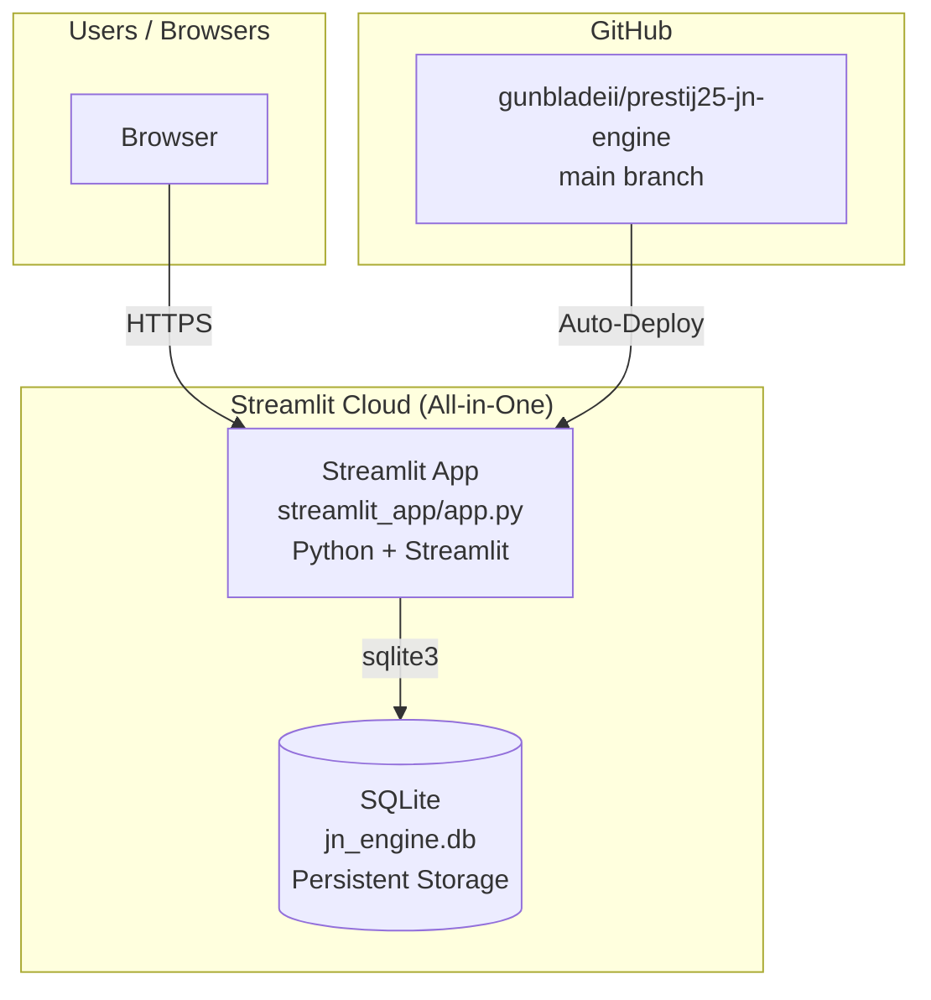
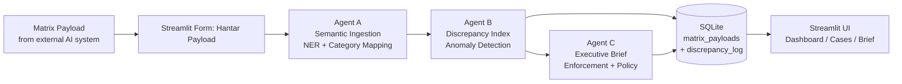

# SYSTEM CONTROLLER — Jemaah Nazir Smart Check & Balance Engine

> **Purpose:** Master reference document for ALL AI/agent interactions with this system.
> Any model, agent, or orchestrator MUST read this file before planning, coding, or deploying.
> This prevents hallucinated architecture, wrong URLs, dropped services, and out-of-sync plans.

---

## 1. SYSTEM IDENTITY

| Property | Value |
|----------|-------|
| **System Name** | JN Resolusi — Smart Cross-Reference & Audit Engine |
| **Programme** | PRESTIJ-25, MoE Agentic AI |
| **Tagline** | Supreme Truth & Audit Node |
| **Live App** | `https://prestij25-jn-engine.streamlit.app` (Streamlit Cloud) |
| **GitHub Org** | `gunbladeii` |
| **Primary Repo** | `gunbladeii/prestij25-jn-engine` |
| **Legacy Frontend** | `https://ai-agentic-complaint.netlify.app` (Netlify — SHUT DOWN) |
| **Legacy Backend** | `https://prestij25-jn-engine.onrender.com` (Render — SHUT DOWN) |
| **Legacy Repo** | `gunbladeii/prestijAI` (HTML only — DO NOT USE) |

---

## 2. ARCHITECTURE DIAGRAM



### Data Flow (Ingest Pipeline)



---

## 3. DEPLOYMENT TOPOGRAPHY

### Production (Live)

| Layer | Platform | Service Name | URL |
|-------|----------|-------------|-----|
| **App (BE+FE+DB)** | Streamlit Cloud | `prestij25-jn-engine` | `https://prestij25-jn-engine.streamlit.app` |
| **Database** | SQLite (embedded) | `~/.jn_engine/jn_engine.db` | Auto-managed |
| **Source** | GitHub | `gunbladeii/prestij25-jn-engine` | `main` branch |

### Legacy (SHUT DOWN — 2026-06-27)

| Layer | Platform | Reason |
|-------|----------|--------|
| Netlify | `ai-agentic-complaint` | Ran out of free credits |
| Render | `prestij25-jn-engine` | Migrated to Streamlit |
| Render DB | `prestij25-jn-db` | Migrated to SQLite |

### Streamlit Cloud Details

- **Main file:** `streamlit_app/app.py`
- **Python:** 3.9+ (auto-detected)
- **Dependencies:** Auto-installed from `streamlit_app/requirements.txt`
- **Deploy:** Push to `main` → auto-redeploys in ~2 min
- **DB:** SQLite with `check_same_thread=False` for multi-threaded env

### Local Development

```bash
cd streamlit_app/
pip install -r requirements.txt
streamlit run app.py
# App: http://localhost:8501
```

---

## 4. FULL STACK & DEPENDENCIES

### Streamlit App (Python)

| Package | Version | Purpose |
|---------|---------|---------|
| `streamlit` | >=1.28.0 | UI framework (BE+FE all-in-one) |
| `python-jose` | >=3.3.0 | JWT authentication (pure Python, no [cryptography] extra) |
| `passlib` | >=1.7.4 | Password hashing — sha256_crypt (pure Python, no [bcrypt] extra) |
| `pandas` | >=1.5.0 | CSV processing & data handling |
| `python-dotenv` | >=1.0.0 | Environment variable loading |

> ⚠️ **CRITICAL:** `passlib[bcrypt]` and `python-jose[cryptography]` require compiled C extensions that fail on Streamlit Cloud. Use plain `passlib` (sha256_crypt) and `python-jose` (no extras).

### Database

| Property | Value |
|----------|-------|
| **Engine** | SQLite 3 (embedded) |
| **Location** | `~/.jn_engine/jn_engine.db` |
| **Connection** | `check_same_thread=False` (required for Streamlit multi-threading) |
| **Tables** | `users`, `jn_audit_records`, `matrix_payloads`, `discrepancy_log` |

### Layout (CSS Grid)

| Property | Value |
|----------|-------|
| **Sidebar** | `position:fixed;width:260px` |
| **App Body** | `grid-column:2` (NOT `margin-left:260px` — causes shrink) |
| **Stat Grid Breakpoint** | `max-width:1500px` (NOT `1100px` — too narrow) |
| **Mobile** | `@media(max-width:768px)` — `grid-column:auto` (NOT `margin-left:0`) |

---

## 5. FILE STRUCTURE

### Workspace Root: `c:\Users\HP\Documents\prestijProject\`

```
prestijProject/
├── REQUIREMENTS.md               ← THIS FILE — master reference (updated 2026-06-27)
├── promp1.txt                    ← scratch notes
│
├── streamlit_app/                ← 🔥 PRODUCTION (Streamlit Cloud)
│   ├── app.py                    ← Main Streamlit app (BE+FE+DB in one file)
│   ├── requirements.txt          ← streamlit, jose, passlib, pandas
│   ├── .streamlit/
│   │   └── config.toml           ← Dark theme JN Resolusi
│   └── agents/
│       ├── __init__.py
│       ├── agent_a.py            ← Semantic ingestion / NER
│       ├── agent_b.py            ← Discrepancy index calculation
│       └── agent_c.py            ← Executive brief + enforcement
│
├── webapps/                      ← LEGACY (Netlify + Render — SHUT DOWN)
│   ├── netlify.toml              ← Netlify config (no longer active)
│   ├── render.yaml               ← Render Blueprint (no longer active)
│   ├── backend/
│   │   ├── main.py               ← FastAPI server (PostgreSQL-backed)
│   │   ├── requirements.txt
│   │   └── agents/               ← (same agents, legacy copy)
│   ├── frontend/
│   │   └── index.html            ← SPA (all CSS/JS inline — FIXED: grid-column:2)
│   └── database/
│       └── schema.sql
│
├── backend/                      ← Git-tracked copy of webapps/backend/
├── frontend/                     ← Git-tracked copy of webapps/frontend/
│   ├── index.html                ← FIXED: grid-column:2, 1500px breakpoint
│   └── manifest.json
│
└── jemaah-nazir-engine/          ← LOCAL DEV (Docker Compose — LEGACY)
    ├── docker-compose.yml
    ├── backend/...
    └── docs/
```

> ⚠️ **IMPORTANT:** `streamlit_app/` is the PRODUCTION code deployed on Streamlit Cloud.
> `webapps/` and root-level `backend/`/`frontend/` are LEGACY from the Netlify+Render era.
> Git repo root is `prestijProject/` — NOT `webapps/`. Commits must be made from the root.

---

## 6. UI NAVIGATION (Streamlit)

Base URL: `https://prestij25-jn-engine.streamlit.app`

> ⚠️ All pages except Login require authentication. Login restricted to `@moe.gov.my` / `@moe-dl.edu.my` domains.

### Auth

| Page | Role Required | Description |
|------|--------------|-------------|
| Log Masuk | Public | Email + password → JWT stored in session |
| Sidebar | Authenticated | Shows user email + role badge + logout button |

### RBAC Roles

| Role | Description | Write | CSV | Admin Panel |
|------|-------------|-------|-----|------------|
| `admin` | Full control | ✅ | ✅ | ✅ |
| `penyelaras_jn` | Inspector/coordinator | ✅ | ✅ | ❌ |
| `peneraju_sektor` | Read-only viewer | ❌ | ❌ | ❌ |

### Pages

| Page | Icon | Role | Description |
|------|------|------|-------------|
| Papan Pemuka | 📊 | All | Dashboard with stat cards + DI chart |
| Hantar Payload | 📤 | admin, penyelaras_jn | Submit payload → Agent A→B→C pipeline |
| Log Kes | 📋 | All | All processed cases table |
| Ringkasan Eksekutif | 📄 | All | Full executive brief for selected case |
| Maklumat Sistem | ℹ️ | All | System architecture + tech stack info |
| Muat Naik CSV | 📁 | admin, penyelaras_jn | Bulk CSV upload → pipeline |
| Pengurusan Pengguna | 👥 | admin | Create/list users |

---

## 7. DATABASE SCHEMA

### SQLite Tables (auto-created by `app.py` on startup)

#### `users` — Auth accounts
```
id (TEXT PK), email (TEXT UNIQUE), password_hash (TEXT),
role (TEXT), is_active (INTEGER), created_at (TEXT)
```
- Default admin: `admin@moe.gov.my` / `admin1234` (seeded on first run)
- Password hash: `sha256_crypt` (pure Python, no bcrypt)

#### `matrix_payloads` — Raw ingest log
```
id (TEXT PK), source_system_id, source_system_name, source_version,
school_id, raw_text_extracted, operational_score (REAL),
mapped_category, severity_level, extracted_entities (TEXT/JSON),
received_at (TEXT)
```

#### `discrepancy_log` — Agent B/C output (THE main table for cases)
```
id (TEXT PK), case_id (TEXT UNIQUE), school_id, school_name, state,
source_system_name, audit_score_reference (REAL),
operational_score_reported (REAL), score_delta (REAL),
discrepancy_index (REAL), di_classification, flags (TEXT/JSON),
anomaly_detected (INTEGER), confidence_score (REAL),
agent_a_result (TEXT/JSON), agent_c_result (TEXT/JSON),
brief_content (TEXT/JSON), timestamp (TEXT)
```

#### `jn_audit_records` — Seed audit data (7 schools)
```
school_id (TEXT PK), school_name, school_type, district, state,
last_audit_date, skpmg2_score (REAL), facility_gred,
canteen_hygiene_score (REAL), integrity_risk_index (REAL),
created_at (TEXT)
```
- Seeded automatically on first run (INSERT OR IGNORE)
- Fallback: `UNKNOWN99` — used when school_id not found in audit DB

### DI Classification Thresholds
| Range | Classification |
|-------|---------------|
| ≥ 0.75 | EXTREME DISCREPANCY |
| ≥ 0.50 | SEVERE DISCREPANCY |
| ≥ 0.25 | MODERATE DISCREPANCY |
| ≥ 0.10 | MINOR DISCREPANCY |
| < 0.10 | DATA ALIGNED |

Formula: `DI = |Audit Score − Operational Score| / 100`

---

## 8. ENVIRONMENT VARIABLES

### Streamlit Cloud

| Key | Default | Purpose |
|-----|---------|---------|
| `JWT_SECRET` | `jnresolusi-dev-secret-2025-changeme` | JWT signing key (CHANGE IN PROD) |
| `JWT_EXPIRE_HOURS` | `24` | Token expiry |

> Database uses SQLite at `~/.jn_engine/jn_engine.db` — no external DB connection needed.
> No more `DATABASE_URL`, `PYTHON_VERSION`, `RENDER_SERVICE_NAME`, or `PORT` needed.

---

## 9. AGENT PIPELINE

### Agent A — Semantic Ingestion & Mapping
- **File:** `backend/agents/agent_a.py`
- **Function:** `agent_a.run(school_id, raw_text, source_system_id)`
- **Does:** NER-style entity extraction, category mapping (Facilities, Academic Quality, Discipline, Administrative Misconduct), severity classification
- **Returns:** `mapped_category`, `category_confidence`, `severity`, `severity_confidence`, `extracted_entities`, `processing_notes`

### Agent B — Discrepancy Index & Anomaly Detection
- **File:** `backend/agents/agent_b.py`
- **Function:** `agent_b.run(school_id, operational_score, agent_a_result, source_system_id)`
- **Does:** Compares operational score vs audit reference, calculates DI, flags anomalies
- **Returns:** `case_id`, `discrepancy_index`, `di_classification`, `flags`, `anomaly_detected`, `confidence_score`, `audit_data_snapshot`, `score_delta`

### Agent C — Executive Brief & Enforcement
- **File:** `backend/agents/agent_c.py`
- **Function:** `agent_c.run(payload_school_id, source_system_name, agent_a, agent_b)`
- **Does:** Generates executive directive, policy recommendations, enforcement actions
- **Returns:** `alert_status_label`, `alert_color_code`, `school_name`, `state`, `enforcement_actions`, `policy_recommendations`, `executive_directive_text`

---

## 10. DEPLOYMENT WORKFLOW

### Push-to-Deploy Pipeline (Streamlit Cloud)

```
1. Edit files in streamlit_app/
2. git add → git commit → git push origin main
3. Streamlit Cloud: Auto-detects push → rebuilds → deploys in ~2 min
4. No manual steps required
```

### Manual Redeploy (if needed)

- **Streamlit Cloud:** [Dashboard](https://share.streamlit.io) → app → ⋮ → Reboot

### Known Issues & Fixes

| Issue | Cause | Fix |
|-------|-------|-----|
| App stuck "in the oven" 40+ min | Dependency conflict / build hang | Delete & redeploy |
| "SQLite objects thread" error | Streamlit multi-threaded | `check_same_thread=False` |
| `passlib[bcrypt]` build fails | Requires C compiler | Use plain `passlib` (sha256_crypt) |
| `.app-body` shrinking | `margin-left` instead of `grid-column` | Use `grid-column:2` |
| Stat cards too narrow on laptop | Breakpoint at 1100px | Change to `max-width:1500px` |
| Render deploy fails | `[bcrypt]` / `[cryptography]` extras | Remove extras from requirements |

### Database Note

- **SQLite schema auto-creates** on first `init_db()` call (CREATE TABLE IF NOT EXISTS)
- **Seed data auto-inserts** (7 Jemaah Nazir audit records + default admin)
- **Data persists** in `~/.jn_engine/jn_engine.db` on Streamlit Cloud
- Streamlit Cloud free tier: apps sleep after inactivity, wake on next request

---

## 11. RULES FOR AI / AGENT INTERACTION

> **MANDATORY — Any AI model working on this system MUST follow these rules:**

### DO ✅

1. **READ THIS FILE FIRST** before any planning or coding
2. **All API paths** must start with `/api/v1/`
3. **Frontend API calls** use `const API = ''` (same-origin via Netlify proxy)
4. **Backend changes** go in `webapps/backend/` (production) — NOT `jemaah-nazir-engine/`
5. **Database queries** use `asyncpg` — parameterized with `$1, $2...`
6. **All POST ingest** must pass through Agent A → B → C pipeline
7. **Render URL scheme fix:** `postgres://` → `postgresql://` for asyncpg
8. **CORS:** wildcard `*` — safe because Netlify proxies same-origin
9. **Commit messages** in English, descriptive
10. **Test on live URLs** before declaring success

### DON'T ❌

1. **DO NOT** hardcode `localhost` URLs in production code
2. **DO NOT** use `gunbladeii/prestijAI` repo — it's legacy HTML only
3. **DO NOT** remove the Netlify proxy redirect — frontend breaks
4. **DO NOT** change the `render.yaml` service name — breaks Blueprint
5. **DO NOT** add new dependencies without updating `requirements.txt`
6. **DO NOT** use synchronous DB drivers — only `asyncpg` (async)
7. **DO NOT** bypass the Agent pipeline for ingest
8. **DO NOT** change the `case_id` format (`PRESTIJ-YYYYMMDD-XXXXXXXX`)
9. **DO NOT** assume data is in-memory — it's PostgreSQL
10. **DO NOT** modify `jemaah-nazir-engine/` when the production code is in `webapps/`

---

## 12. LIVE VERIFICATION CHECKLIST

Use these to verify system health after any change:

```bash
# 1. Backend health
curl https://prestij25-jn-engine.onrender.com/api/v1/health
# Expect: db_connected: true, agents_online: [Agent_A, Agent_B, Agent_C]

# 2. Frontend proxy health
curl https://ai-agentic-complaint.netlify.app/api/v1/health
# Expect: same JSON response

# 3. Frontend loads
curl -s https://ai-agentic-complaint.netlify.app/ | grep "AI-Complaint-MOE"
# Expect: title tag found

# 4. Ingest test
curl -X POST https://prestij25-jn-engine.onrender.com/api/v1/matrix/ingest \
  -H "Content-Type: application/json" \
  -d '{"source_system_id":"TEST-01","source_system_name":"Test","school_id":"SBP001","raw_text":"Test payload for verification","operational_score":93.0}'
# Expect: status ACCEPTED, case_id returned

# 5. Cases list
curl https://prestij25-jn-engine.onrender.com/api/v1/matrix/cases
# Expect: total_cases > 0, cases array
```

---

## 13. QUICK REFERENCE COMMANDS

### Local Dev (Streamlit)
```powershell
cd C:\Users\HP\Documents\prestijProject\streamlit_app
pip install -r requirements.txt
streamlit run app.py
# Open http://localhost:8501
```

### Git Workflow
```powershell
cd C:\Users\HP\Documents\prestijProject\webapps
git add -A    # stage from repo root (prestijProject/)
git commit -m "descriptive message"
git push origin main
# Streamlit Cloud auto-deploys in ~2 min
```

> ⚠️ Git repo root is `C:\Users\HP\Documents\prestijProject\` — NOT `webapps/`.
> Commit from `webapps/` directory but files are tracked relative to repo root.

---

## 14. CURRENT STATE (Last Updated: 2026-06-27 11:30 MYT)

| Item | Status |
|------|--------|
| **Streamlit App** | ✅ Live at `prestij25-jn-engine.streamlit.app` |
| **Database** | ✅ SQLite connected (`~/.jn_engine/jn_engine.db`) |
| **3 Agents** | ✅ Agent A, B, C online |
| **JWT Auth** | ✅ Login + domain restriction (@moe.gov.my / @moe-dl.edu.my) |
| **RBAC** | ✅ 3 roles: admin, penyelaras_jn, peneraju_sektor |
| **CSV Bulk Upload** | ✅ Via Streamlit file uploader |
| **Admin Panel** | ✅ User management page |
| **Default Admin** | ✅ `admin@moe.gov.my` / `admin1234` |
| **Layout Grid Fix** | ✅ `grid-column:2` + 1500px breakpoint |
| **Passlib Fix** | ✅ `sha256_crypt` (pure Python, no bcrypt) |
| **SQLite Thread Fix** | ✅ `check_same_thread=False` |
| Netlify | ❌ SHUT DOWN (credits expired) |
| Render.com | ❌ SHUT DOWN (migrated to Streamlit) |
| Streamlit Cloud Free Tier | ⚠️ Apps sleep after inactivity |

---

## 15. MIGRATION HISTORY

| Date | Change | Reason |
|------|--------|--------|
| 2026-06-27 | Migrated from Netlify+Render to Streamlit Cloud | Netlify credits expired; single-platform simpler |
| 2026-06-27 | PostgreSQL → SQLite | Streamlit Cloud doesn't provide managed PostgreSQL |
| 2026-06-27 | `passlib[bcrypt]` → `passlib` (sha256_crypt) | bcrypt compilation fails on Streamlit Cloud |
| 2026-06-27 | `python-jose[cryptography]` → `python-jose` | cryptography compilation fails on Streamlit Cloud |
| 2026-06-27 | `.app-body{margin-left}` → `grid-column:2` | Layout shrink fix restored after sync overwrite |
| 2026-06-27 | `webapps/` path → root `prestijProject/` sync | Git tracked wrong directory; files not deploying |

---

> **This file is the SINGLE SOURCE OF TRUTH for system architecture.**
> If any AI model or agent suggests something that contradicts this document,
> REJECT the suggestion and point to this file.
>
> Maintainer: Update this file whenever architecture changes.
